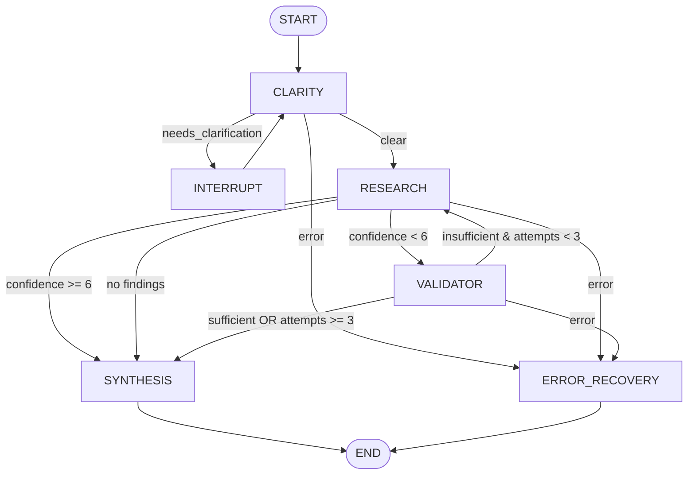
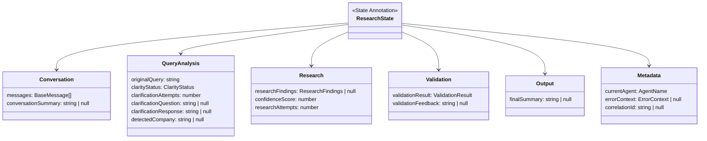

# Architecture: LangGraph Research Assistant

A TypeScript workflow built with [LangGraph](https://langchain-ai.github.io/langgraphjs/) that researches companies using AI agents. The system handles query clarification, data retrieval, quality validation, and response synthesis with built-in error recovery.

**Tech Stack**: LangGraph, LangChain, Claude (Anthropic), TypeScript, Zod

---

## High-Level Flow



---

## Agent Reference

| Agent              | Purpose                               | Key Inputs                               | Key Outputs                              |
| ------------------ | ------------------------------------- | ---------------------------------------- | ---------------------------------------- |
| **Clarity**        | Analyzes query, extracts company name | `originalQuery`, `clarificationResponse` | `clarityStatus`, `detectedCompany`       |
| **Interrupt**      | Pauses for user clarification         | `clarificationQuestion`                  | `clarificationResponse`                  |
| **Research**       | Fetches data from sources             | `detectedCompany`, `validationFeedback`  | `researchFindings`, `confidenceScore`    |
| **Validator**      | Assesses research quality             | `researchFindings`, `originalQuery`      | `validationResult`, `validationFeedback` |
| **Synthesis**      | Generates user-facing summary         | `researchFindings`, `confidenceScore`    | `finalSummary`                           |
| **Error Recovery** | Handles errors gracefully             | `errorContext`                           | `finalSummary` (error message)           |

---

## Agent Behaviors

### 1. Clarity Agent

**File**: `src/agents/clarity.agent.ts`

Analyzes user queries to determine if they're actionable and extracts the target company.

**Key Logic**:

- Uses structured output (Zod schema) for reliable parsing
- Normalizes company names (e.g., "apple" → "Apple Inc.")
- Detects follow-up questions using previous `detectedCompany` context
- Increments `clarificationAttempts` when requesting clarification
- Falls back to heuristic extraction if LLM fails

**State Updates**:

- Reads: `originalQuery`, `detectedCompany`, `clarificationResponse`, `messages`
- Writes: `clarityStatus`, `detectedCompany`, `clarificationQuestion`, `clarificationAttempts`

**Edge Cases**:

- Max 2 clarification attempts before forced proceed
- Empty queries treated as needing clarification
- Company persists across follow-up questions

---

### 2. Interrupt Agent

**File**: `src/agents/interrupt.agent.ts`

Implements human-in-the-loop by pausing execution for user input.

**Key Logic**:

- Uses LangGraph's `interrupt()` function to pause graph
- Re-executes entirely on resume (code before `interrupt()` must be idempotent)
- Validates user response before processing
- Does NOT increment attempts (Clarity Agent's responsibility)

**State Updates**:

- Reads: `clarificationQuestion`, `clarificationAttempts`
- Writes: `clarificationResponse`, `clarityStatus` (reset to "pending"), `messages`

**Critical Behavior**:

```
IDEMPOTENT ZONE:     prepare payload, call interrupt()
  ↓ (pauses here, resumes with user value)
SAFE ZONE:           validate response, update state
```

---

### 3. Research Agent

**File**: `src/agents/research.agent.ts`

Queries data sources for company information.

**Key Logic**:

- Uses configurable data source (Tavily or Mock)
- Increments `researchAttempts` on each run
- Uses `validationFeedback` to refine retry searches
- Returns null findings on error (doesn't crash)

**State Updates**:

- Reads: `detectedCompany`, `originalQuery`, `validationFeedback`
- Writes: `researchFindings`, `confidenceScore`, `researchAttempts`

**Data Structure** (`ResearchFindings`):

```typescript
{
  company: string,
  recentNews: string | null,
  stockInfo: string | null,
  keyDevelopments: string | null,
  sources: string[],
  rawData: Record<string, unknown>
}
```

---

### 4. Validator Agent

**File**: `src/agents/validator.agent.ts`

Evaluates research quality and determines if findings answer the query.

**Key Logic**:

- Uses structured output for reliable validation
- Applies token budget (6000 tokens) to findings before analysis
- Falls back to rule-based validation if LLM fails:
  - Requires: `recentNews` OR `keyDevelopments`
  - Requires: >= 2 sources
  - `stockInfo` optional but contributes

**State Updates**:

- Reads: `researchFindings`, `originalQuery`, `confidenceScore`
- Writes: `validationResult`, `validationFeedback`

---

### 5. Synthesis Agent

**File**: `src/agents/synthesis.agent.ts`

Generates a user-friendly summary of research findings.

**Key Logic**:

- Applies token budget (8000 tokens) to findings
- Adds confidence disclaimers based on score:
  - High (>= 8): No prefix
  - Medium (5-7): "_I found some information, but couldn't verify all details:_"
  - Low (< 5): "**Note**: Based on limited available information:"
- Graceful fallback if LLM fails

**State Updates**:

- Reads: `researchFindings`, `originalQuery`, `confidenceScore`, `validationResult`
- Writes: `finalSummary`, `messages`

---

### 6. Error Recovery Agent

**File**: `src/agents/error-recovery.agent.ts`

Handles unexpected errors with context-aware messages.

**Key Logic**:

- Generates user-friendly messages based on which agent failed
- Returns partial data when available
- Clears `errorContext` after handling

**Error-Specific Responses**:

- Research failure: "I had trouble finding information..."
- Clarity failure: "I had trouble understanding..."
- Validator failure: Returns partial findings with disclaimer
- Synthesis failure: Returns unpolished findings

---

## State Schema



**Reducer**: All fields use "last write wins" except `messages` (uses LangGraph's message merging).

**Source**: `src/graph/state.ts`

---

## Routing Logic

### Clarity Router

**File**: `src/graph/routers.ts:clarityRouter`

```
if errorContext exists → ERROR_RECOVERY
else if clarityStatus == "needs_clarification" → INTERRUPT
else → RESEARCH
```

### Research Router

**File**: `src/graph/routers.ts:researchRouter`

```
if errorContext exists → ERROR_RECOVERY
else if no researchFindings → SYNTHESIS (fallback)
else if confidenceScore >= 6 → SYNTHESIS (skip validation)
else → VALIDATOR
```

### Validation Router

**File**: `src/graph/routers.ts:validationRouter`

```
if errorContext exists → ERROR_RECOVERY
else if validationResult == "insufficient" AND researchAttempts < 3 → RESEARCH (retry)
else → SYNTHESIS
```

---

## Thresholds & Constants

**File**: `src/utils/constants.ts`

| Constant                      | Value | Purpose                                        |
| ----------------------------- | ----- | ---------------------------------------------- |
| `CONFIDENCE_THRESHOLD`        | 6     | Skip validation if confidence >= this          |
| `CONFIDENCE_HIGH_THRESHOLD`   | 8     | "High" confidence messaging                    |
| `CONFIDENCE_MEDIUM_THRESHOLD` | 5     | "Medium" confidence messaging                  |
| `MAX_RESEARCH_ATTEMPTS`       | 3     | Retry limit for research                       |
| `MAX_CLARIFICATION_ATTEMPTS`  | 2     | Clarification loop limit                       |
| `SUMMARIZATION_THRESHOLD`     | 8000  | Token threshold for conversation summarization |

**Token Budgets**:
| Agent | Budget | Purpose |
|-------|--------|---------|
| Validator | 6000 tokens | Findings size for quality assessment |
| Synthesis | 8000 tokens | Larger content for final response |
| Clarity | 4000 tokens | Conversation context |

---

## Supporting Infrastructure

### Data Sources

**Directory**: `src/sources/`

- **Tavily** (`tavily-source.ts`): Production search API with topic detection
- **Mock** (`mock-source.ts`): Deterministic responses for testing

Factory auto-detects based on `RESEARCH_DATA_SOURCE` env var.

### Error Handling

**File**: `src/utils/error-wrapper.ts`

- `withErrorHandling()` wraps main agents (NOT Interrupt or Error Recovery)
- Catches exceptions, populates `errorContext`, routes to Error Recovery
- Prevents graph crashes

### Token Management

**File**: `src/utils/token-budget.ts`

- Uses `js-tiktoken` for accurate counting
- `truncateToFit()` truncates at sentence boundaries
- Prevents context window overflow

### Observability

- **Correlation IDs**: Track requests across all agents (`correlationId`)
- **Structured Logging**: `src/utils/logger.ts` with log levels
- **Current Agent Tracking**: `currentAgent` field for streaming/progress

---

## Key Files

| File                     | Purpose                            |
| ------------------------ | ---------------------------------- |
| `src/graph/workflow.ts`  | Graph construction and compilation |
| `src/graph/state.ts`     | State schema definition            |
| `src/graph/routers.ts`   | Conditional routing functions      |
| `src/graph/routes.ts`    | Agent name constants               |
| `src/agents/*.agent.ts`  | Individual agent implementations   |
| `src/utils/constants.ts` | Workflow thresholds                |
| `src/sources/`           | Data source implementations        |
| `src/index.ts`           | CLI entry point                    |
