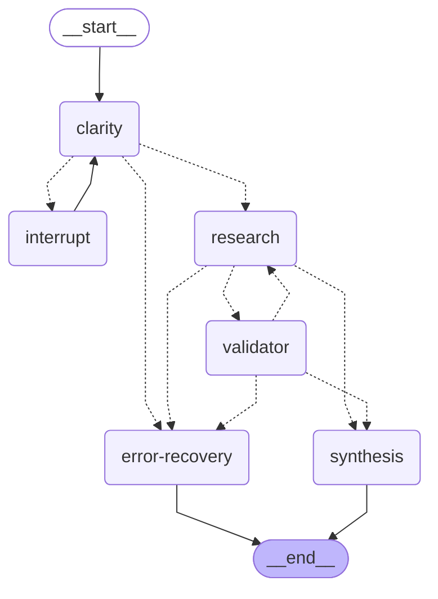

# Research Assistant Graph

## Node Descriptions

- **clarity**: Analyzes query and detects company name
- **interrupt**: Pauses for user clarification when needed
- **research**: Fetches data from Tavily or mock sources
- **validator**: Checks if research findings are sufficient
- **synthesis**: Generates final user-facing summary
